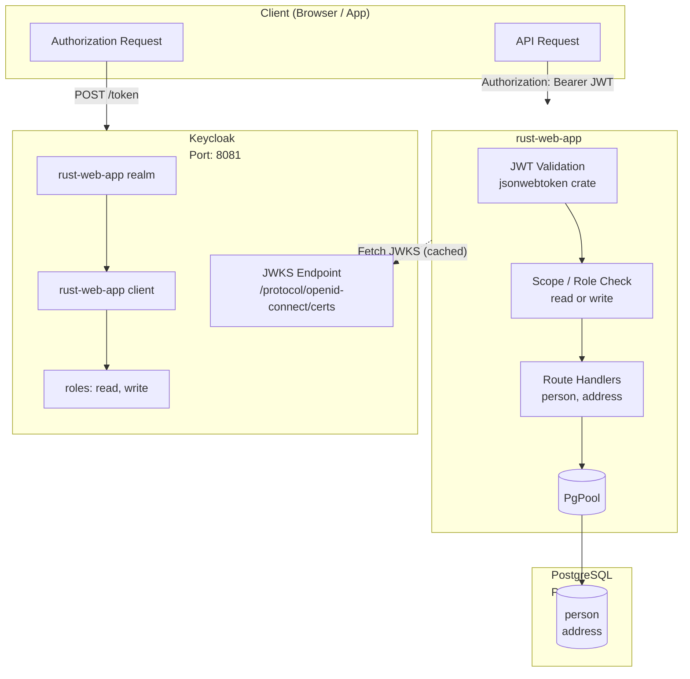
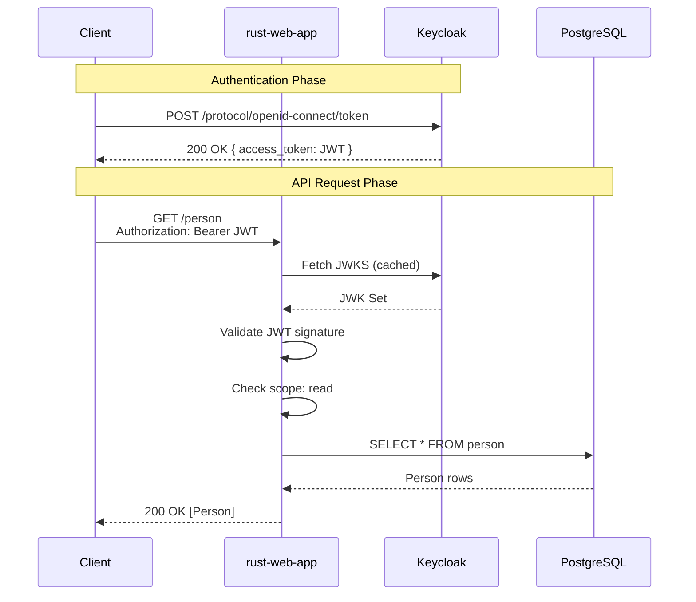

# rust-web-app

A RESTful API built with **Axum**, **SQLx** (PostgreSQL), and **Keycloak** for OAuth2/OIDC authentication.

---

## Table of Contents

- [Architecture](#architecture)
- [Pre-requisites](#pre-requisites)
- [Quick Start](#quick-start)
- [Make Targets](#make-targets)
- [Environment Variables](#environment-variables)
- [Authentication](#authentication)
  - [Getting a Token](#getting-a-token)
  - [Test Users](#test-users)
- [API Endpoints](#api-endpoints)
- [Database Migrations](#database-migrations)
- [Testing](#testing)

---

## Architecture

### Service Overview



### Request Flow



---

## Pre-requisites

| Tool | Version | Purpose |
|------|---------|---------|
| [Rust](https://www.rust-lang.org/tools/install) | ^1.75.0 | Language & package manager |
| [Docker](https://www.docker.com/products/docker-desktop/) | Latest | Run Keycloak and PostgreSQL |
| [jq](https://jqlang.github.io/jq/) | Latest | Keycloak setup script (JSON parsing) |

---

## Quick Start

```sh
# 1. Start dependencies, apply migrations, and compile
make

# 2. Run the application
cargo run
```

The application will be available at:

| Service | URL | Description |
|---------|-----|-------------|
| API | [http://localhost:8080](http://localhost:8080) | REST API root |
| Swagger UI | [http://localhost:8080/swagger-ui](http://localhost:8080/swagger-ui) | Interactive API docs |
| OpenAPI Spec | [http://localhost:8080/api-doc/openapi.json](http://localhost:8080/api-doc/openapi.json) | Machine-readable spec |
| Keycloak Admin | [http://localhost:8081/admin](http://localhost:8081/admin) | Keycloak console (admin/admin) |

---

## Make Targets

| Command | Description |
|---------|-------------|
| `make all` | Start services, apply migrations, compile (default) |
| `make up` | Start PostgreSQL + Keycloak, provision realm/client/users, run migrations |
| `make down` | Stop and remove containers |
| `make build` | Compile the project (services + migrations first) |
| `make lint` | Run clippy lints (services + migrations first) |
| `make test` | Run all tests (services + migrations first) |
| `make clean` | Stop services and remove build artifacts |

---

## Environment Variables

| Variable | Required | Default | Description |
|----------|----------|---------|-------------|
| `DATABASE_URL` | ✅ | — | PostgreSQL connection string |
| `DATABASE_SCHEMA` | ❌ | `public` | PostgreSQL schema name |
| `DB_POOL_SIZE` | ❌ | `10` | Maximum database connections |
| `AUTH_URL` | ✅ | — | Keycloak realm URL (e.g. `http://localhost:8081/realms/rust-web-app`) |
| `ISSUER_URL` | ❌ | — | Expected JWT issuer claim |
| `AUDIENCE` | ❌ | — | Expected JWT audience / client ID |
| `SERVER_PORT` | ❌ | `8080` | HTTP listen port for the API |

> **Note:** The `.env` file is loaded automatically. Edit it to change defaults.

---

## Authentication

The API uses **JWT Bearer tokens** issued by Keycloak. All protected endpoints require a valid token with the appropriate scope/role.

### Getting a Token

```sh
curl -X POST http://localhost:8081/realms/rust-web-app/protocol/openid-connect/token \
  -d 'grant_type=password' \
  -d 'client_id=rust-web-app' \
  -d 'username=writer' \
  -d 'password=writer-pass' | jq .
```

Response:
```json
{
  "access_token": "eyJhbGciOiJSUzI1NiIsInR5cCI6IkpXVCJ9...",
  "expires_in": 60,
  "refresh_expires_in": 1800,
  "token_type": "Bearer",
  "not-before-policy": 0,
  "scope": "openid"
}
```

### Test Users

| Username | Password | Roles | Can access |
|----------|----------|-------|------------|
| `reader` | `reader-pass` | `read` | GET endpoints only |
| `writer` | `writer-pass` | `read`, `write` | All endpoints |

### Using a Token

```sh
TOKEN=$(curl -s -X POST http://localhost:8081/realms/rust-web-app/protocol/openid-connect/token \
  -d 'grant_type=password' \
  -d 'client_id=rust-web-app' \
  -d 'username=writer' \
  -d 'password=writer-pass' | jq -r '.access_token')

# List all people (requires "read")
curl -s http://localhost:8080/person \
  -H "Authorization: Bearer $TOKEN" | jq .

# Create a person (requires "write")
curl -s -X POST http://localhost:8080/person \
  -H "Authorization: Bearer $TOKEN" \
  -H "Content-Type: application/json" \
  -d '{
    "firstName": "John",
    "familyName": "Doe",
    "dateOfBirth": "1990-01-15"
  }' | jq .
```

---

## API Endpoints

### Person

| Method | Path | Scope | Description |
|--------|------|-------|-------------|
| `GET` | `/person` | `read` | List all people |
| `POST` | `/person` | `write` | Create a new person |
| `GET` | `/person/{uuid}` | `read` | Get a person by UUID |
| `PUT` | `/person/{uuid}` | `write` | Update a person |
| `DELETE` | `/person/{uuid}` | `write` | Delete a person |

### Address

| Method | Path | Scope | Description |
|--------|------|-------|-------------|
| `POST` | `/person/{uuid}/address` | `write` | Add an address for a person |
| `DELETE` | `/address/{uuid}` | `write` | Remove an address |

---

## Database Migrations

Migrations are stored in `db/migrations/` and managed by **SQLx**.

```sh
# Run pending migrations (handled automatically by make up)
sqlx migrate run --source=db/migrations

# Create a new migration
sqlx migrate add --source=db/migrations create_new_table
```

---

## Testing

```sh
# Run all tests (starts dependencies first)
make test

# Run only unit tests (no Docker required)
cargo test --lib

# Run with output
cargo test -- --nocapture
```

The test suite covers:

- **Model validation** — Person and Address field constraints
- **JWT claims parsing** — Scope extraction from both standard `scope` and Keycloak `resource_access` claims
- **Route handling** — Basic HTTP endpoint responses
- **Postcode validation** — UK postcode format checking
